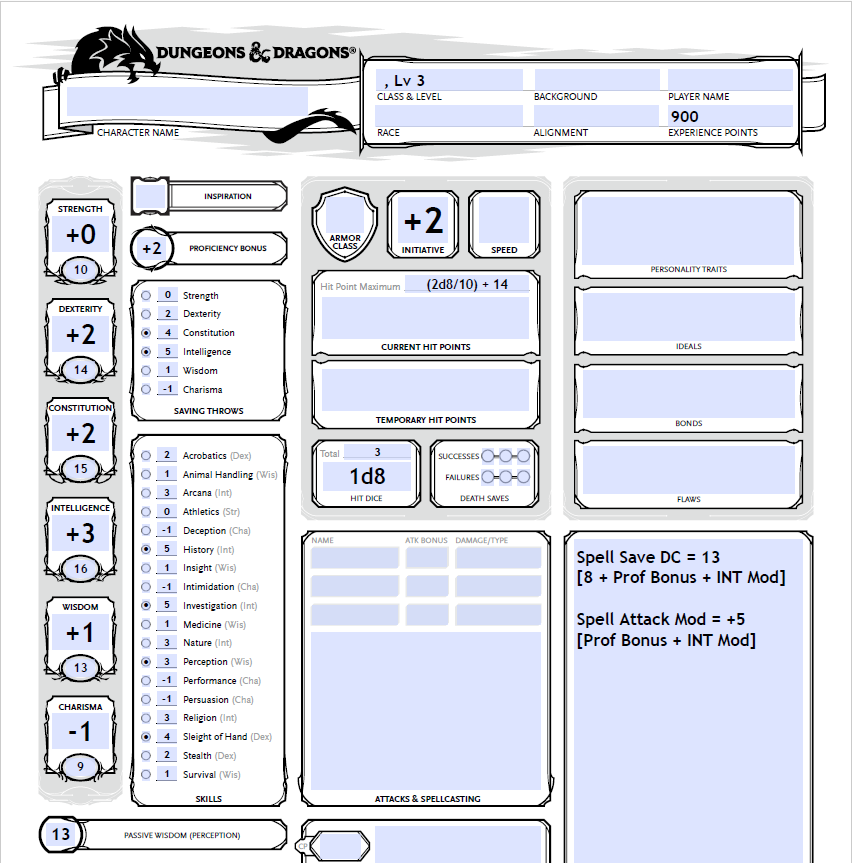

# D&D 5E Character Sheet PDF Filler

## Why?

I spend way too much time manually calculating stats on a character sheet.
There are stat calculation tools out there, but most of them are either too
complex or don't fit my needs. I would still like to have a portable PDF 
without any fancy auto-calculating fields so that the character is fully
customisable.

So why not have a script that handles the one-off calculations for me? :D

## Prerequisites

1. Fillable PDF of D&D character sheet - I recommend [this version](https://www.reddit.com/r/dndnext/comments/7muor6/the_official_dd_5e_character_sheet_as_an_editable/) by TheWebCoder on Reddit.

   Save the PDF as `character-sheet.pdf` in the script working directory.

2. Install Python 3.

3. Install `fillpdf` Python package:

   ```sh
   pip install fillpdf
   ```

## Usage

Prepare a JSON file with the character stats:

```json
{
  "level": <Character Level, int>,
  "hit dice": <Hit Dice, int>,
  "abilities": {
    "STR": <Strength Score, int>,
    "DEX": <Dexterity Score, int>,
    "CON": <Constitution Score, int>,
    "INT": <Intelligence Score, int>,
    "WIS": <Wisdom Score, int>,
    "CHA": <Charisma Score, int>
  },
  "proficiencies": [
    <Proficiency #1, str>,
    <Proficiency #2, str>,
    <Proficiency #3, str>,
    ...
    <Proficiency #N, str>
  ],
  "spellbase": <Spellcaster Ability (Optional), str>
}
```

**Note**: Omit the `spellbase` key if the character is not a spellcaster.

On the command line, run the following command:

```sh
python3 dndfill.py -c <config.json> [-i <input.pdf>] -o output.pdf
```

If no input PDF file is provided, `character-sheet.pdf` will be used as default.

**Note**:
1. The calculations do not take into account race and class features that
   modify certain stats such as abilities, proficiencies, HP, etc.

2. The HP calculation for level 2 and above is given by the formula:

   ```
   HP = (rolled OR average) + base
   ```

   For example:
   
   ```
   HP = (2d8/10) + 14
   ```

   On the filled-in character sheet, pick either the rolled or average value
   and add to the base to get the final HP. The forward slash here is not a
   division.

## Example

JSON config file:

```json
{
  "level": 3,
  "hit dice": 8,
  "abilities": {
    "STR": 10,
    "DEX": 14,
    "CON": 15,
    "INT": 16,
    "WIS": 13,
    "CHA": 9
  },
  "proficiencies": [
    "CON ST",
    "INT ST",
    "History",
    "Investigation",
    "Sleight of Hand",
    "Perception"
  ],
  "spellbase": "INT"
}
```

Output PDF:



## Customisation

To use a different character sheet or switch around certain fields, edit the
`form-fields.json` file. It contains the mapping of human-readable field names
to their corresponding field names in the fillable PDF.

To get the field names in a fillable PDF in Python: 

```python
from fillpdf import fillpdfs

fillpdfs.print_form_fields('character-sheet.pdf')
```
